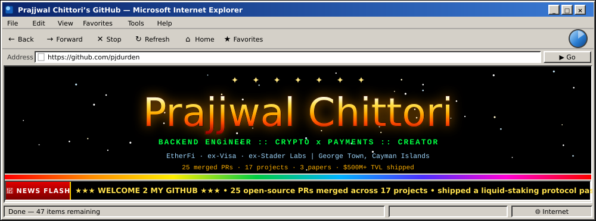

<div align="center">

<a href="https://prajj.com/"></a>

<a href="#home"></a> <a href="#experience"></a> <a href="#research"></a> <a href="#opensource"></a> <a href="#companies"></a> <a href="#creator"></a> <a href="#projects"></a> <a href="https://prajj.com/articles/"></a> <a href="https://prajj.com/fintech/"></a>


</div>

```
 /=========================== *** THE NUMBERS *** ============================\
 |                                                                            |
 |  INSTAGRAM        YOUTUBE         LINKEDIN        GITHUB                   |
 |  +-----------+    +-----------+   +-----------+   +-----------+            |
 |  |  22,000+  |    |   7,860   |   |  5,000+   |   |   live >  |            |
 |  +-----------+    +-----------+   +-----------+   +-----------+            |
 |   followers        subscribers     followers       followers               |
 |                                                                            |
 |  >>  2 0 , 0 0 0 , 0 0 0 +   T O T A L   V I E W S  <<                     |
 |      across Instagram & YouTube - one format, run with                     |
 |      relentless consistency                                                |
 |                                                                            |
 \============================================================================/
```

<div align="center">

<a href="https://www.instagram.com/prajjwalsinghchittori"></a> <a href="https://www.youtube.com/@prajjwalsinghchittori"></a> <a href="https://www.linkedin.com/in/prajjwal-chittori/"></a> <a href="https://github.com/pjdurden"></a> <a href="https://codeforces.com/profile/pjdurden"></a> <a href="https://prajj.com/"></a> <a href="mailto:prajjwalchittoriwork@gmail.com"></a>

</div>


<table>
<tr>
<td width="34%" valign="top">

**Prajjwal** &nbsp;<sub><code>26 / M / KY</code></sub>


<sub><code>prajjwal.jpg &nbsp; 460x460</code></sub>


`✈ Currently in George Town, Cayman Islands 🏝`

♫ **NOW PLAYING** ♫ &nbsp;<code>canon_in_d_REMIX.mid</code>

<sub><code>▶ PLAY</code> &nbsp;<code>■ STOP</code> &nbsp;(sorry, GitHub took the sound card)</sub>

</td>
<td width="33%" valign="top">

**✉ Contacting Prajjwal ✉**

<a href="mailto:prajjwalchittoriwork@gmail.com"></a>
<a href="https://www.linkedin.com/in/prajjwal-chittori/"></a>
<a href="https://github.com/pjdurden?tab=repositories"></a>
<a href="https://www.instagram.com/prajjwalsinghchittori"></a>
<a href="https://www.youtube.com/@prajjwalsinghchittori"></a>
<a href="https://prajj.com/articles/"></a>
<a href="https://github.com/pjdurden?tab=repositories&sort=stargazers"></a>

</td>
<td width="33%" valign="top">

**What's New** &nbsp;<sub><code>🔥 hot</code></sub>

`NEW!` Merged an autoscaler starvation fix in [Ray #65299](https://github.com/ray-project/ray/pull/65299)

`NEW!` Swept a batched-inference mask bug out of 8 models in [candle #3879](https://github.com/huggingface/candle/pull/3879)

`MERGED` Stopped an RDMA endpoint-rebuild storm in [Mooncake #3387](https://github.com/kvcache-ai/Mooncake/pull/3387)

`PAPER` Cache-aware request planning for black-box LLM APIs - [DOI](https://doi.org/10.5281/zenodo.21386594)

`PAPER` Executable correctness under KV-cache compression - [DOI](https://doi.org/10.5281/zenodo.20805562)

</td>
</tr>
</table>

> **Quote of the Day**
>
> *You have power over your mind, not outside events. Realize this, and you will find strength.*
>
> - Marcus Aurelius


<a name="home"></a>

## ░▒▓ 👤 Prajjwal's Blurbs ▓▒░ &nbsp;<sub><code>read me first</code></sub>

**About me:**

Crypto and payments backend engineer. ex-Stader Labs (founding engineer → $500M+ TVL liquid staking), ex-Visa cross-border payments and stablecoins, now Senior Backend Engineer at [ether.fi](https://www.ether.fi/) building the bridge between a Visa card and on-chain settlement. I fix bugs in the infrastructure everybody else builds on - blockchain (Optimism, revm, alloy, celestia-node, ethrex) and AI inference (vLLM, SGLang, candle, mistral.rs, Mooncake, Ray). On the side I explain philosophy to 22,000+ people in 45-second videos.

**Who I'd like to meet:**

People building inference engines, payment rails, and anything with a hard correctness invariant in it. Also anyone who still remembers what a page like this used to look like.

<table>
<tr>
<td width="50%" valign="top">

**Prajjwal's Details**

| | |
|---|---|
| **Status** | Employed & building |
| **Here for** | Serious infrastructure, Networking |
| **Age** | 26 |
| **Location** | George Town, Cayman Islands |
| **Hometown** | Delhi, India |
| **Occupation** | Senior Backend Engineer, ether.fi |
| **Education** | Delhi Technological University, B.Tech CSE |
| **Languages** | Go, Rust, Java, Solidity, Python, TypeScript |
| **Chess** | FIDE-registered, 1600+ |
| **Codeforces** | Expert · ~8,000 problems |

</td>
<td width="50%" valign="top">

**Prajjwal's Interests**

| | |
|---|---|
| **General** | Liquid restaking, payment rails, LLM inference engines, KV caches, order books |
| **Music** | The fan curve of a GPU under load |
| **Books** | Philosophy, mostly. Then business biographies. |
| **Heroes** | People who ship the boring layer everyone else builds on |
| **Movies** | Anything with a heist and a spreadsheet |
| **Stack** | Go · Rust · Solidity · Java/Spring · TypeScript · Ethereum/EVM · EigenLayer · Kafka · PostgreSQL · Redis |

</td>
</tr>
</table>


<a name="experience"></a>

## ░▒▓ 💼 Work Experience ▓▒░ &nbsp;<sub><code>2021 - now</code></sub>

*Backend engineering across crypto and global payments.*

<details open>
<summary><b>ether.fi - Senior Backend Engineer, Card & Vault Products</b>&nbsp; <sub><code>2026 - Present</code></sub></summary>

Building ether.fi Cash, a non-custodial Visa crypto card on liquid-restaking infrastructure where users spend ETH/USDC while their assets continue earning restaking yield.

- Own real-time settlement bridging Visa rails and on-chain vaults (authorization, capture, reconciliation).
- Built the Borrow Mode backend - USDC borrowing against eETH collateral via lending-pool integration.
- Designed an event-driven cashback pipeline (wETH rewards) on Kafka.
- Hardened KYC/AML and risk monitoring with chain-analytics providers; extended multi-chain support across Ethereum L1 and L2s.

`$ Go · Solidity · Ethereum · EigenLayer · Kafka · PostgreSQL · Redis`

</details>
<details open>
<summary><b>Visa - Senior Software Engineer, Payments & Crypto Initiative</b>&nbsp; <sub><code>2022 - 2026</code></sub></summary>

Worked across traditional cross-border payments and Visa's stablecoin / crypto initiative - the bridge between card networks and digital assets.

- Led an 8-engineer team on a real-time payments platform (monolith plus eight microservices) sustaining 2,000+ TPS at 99.98% uptime.
- Delivered Treasury as a Service for the APAC hub - 15 currencies, clients in 60+ countries, powering roughly 80% of APAC liquidity flows through Visa Direct A2A.
- Built the Network Validations Framework - configurable payer/beneficiary identity checks across 100+ SWIFT message types.
- Prototyped on-chain payment settlement in Solidity and Solana as part of the crypto/stablecoin track.

`$ Java · Spring Boot · Solidity · Rust · RabbitMQ · Hazelcast · Docker · Kubernetes`

</details>
<details open>
<summary><b>Stader Labs - Software Engineer, Founding Team</b>&nbsp; <sub><code>2021 - 2022</code></sub></summary>

Joined as an intern during the final years of my degree at Delhi College of Engineering and grew into a founding member of a ~7-person team building a multi-chain liquid-staking protocol.

- Built Rust / CosmWasm smart contracts powering liquidity pools that scaled past $500M+ in staked assets across multiple chains.
- Led gas-fee analysis and optimization - benchmarking storage and swap costs on Terra/CosmWasm to keep contract execution economical at scale.
- Built a validator analytics platform monitoring 1M+ nodes (React, MongoDB, Ethereum APIs) and APR dashboards.
- Designed cross-chain architecture and on-chain/off-chain synchronization pipelines.

`$ Rust · CosmWasm · TypeScript · Python · React · MongoDB`

</details>


<a name="research"></a>

## ░▒▓ 🔬 Research Papers ▓▒░ &nbsp;<sub><code>3 published</code></sub>

*Published, peer-citable work.*

<details>
<summary><b>Cache-aware request planning for black-box LLM APIs</b>&nbsp; <sub><code>2026 · preprint</code></sub></summary>

**Cache-Aware Client-Side Request Planning for Black-Box LLM APIs.** When you consume an LLM through a paid per-token API you pay for the tokens the server processes, so the only lossless lever a client has is re-ordering requests to hit the provider's prompt cache. Formalizes that design space and ships a **greedy prefix-clustering scheduler** that shapes request order to maximize cache hits - **up to 60% billed-cost reduction** on an agentic workload at zero quality loss, Pareto-dominating prompt compression and semantic caching.

[DOI 10.5281/zenodo.21386594](https://doi.org/10.5281/zenodo.21386594) · [pjdurden/cache-aware-request-planning](https://github.com/pjdurden/cache-aware-request-planning)

</details>
<details>
<summary><b>Executable correctness under KV-cache compression</b>&nbsp; <sub><code>2026 · preprint</code></sub></summary>

**Perplexity Holds, Programs Break: Executable Correctness as a Blind Spot of KV-Cache Compression.** KV-cache compression is benchmarked almost entirely on token-overlap and retrieval metrics that never check whether generated code actually runs or a tool call is schema-valid. Introduces **kv-exec-bench**, an open benchmark measuring code unit-test pass@1 and tool-call JSON-Schema validity under compression, built on NVIDIA's `kvpress` so any press works unmodified.

[DOI 10.5281/zenodo.20805562](https://doi.org/10.5281/zenodo.20805562) · [pjdurden/kv-exec-bench](https://github.com/pjdurden/kv-exec-bench)

</details>
<details>
<summary><b>StragglerPolicy - straggler-aware decentralized training</b>&nbsp; <sub><code>2026 · paper</code></sub></summary>

**Straggler-Aware Elastic Membership for Decentralized Training.** A zero-GPU discrete-event simulator of DiLoCo-style decentralized ML training plus a straggler-aware membership policy for *slow-but-alive* nodes that existing decentralized-training stacks don't handle. **4.59x faster** than the baseline on a persistent-straggler scenario, validated against a `torch.distributed`/gloo DiLoCo loop.

[](https://doi.org/10.5281/zenodo.20574905) · [pjdurden/churn](https://github.com/pjdurden/churn)

</details>


<a name="opensource"></a>

## ░▒▓ 💻 Open Source ▓▒░ &nbsp;<sub><code>25 merged · 17 projects</code></sub>

```
 /=================== * PRAJJWAL'S TOP 8 REPOS * ===================\
 |  1. vLLM ............... 1 merged    5. Ray .......... 1 merged  |
 |  2. Mooncake ........... 3 merged    6. Optimism ..... 1 merged  |
 |  3. candle ............. 2 merged    7. revm ......... 1 merged  |
 |  4. SGLang ............. 1 merged    8. Meilisearch .. 1 merged  |
 \==================================================================/
```

*Merged work on the infrastructure other people build on. Star counts are live; expand a project for the actual bug.*

<table>
<tr>
<td align="center" width="25%">
<a href="https://github.com/vllm-project/vllm"><br><b>vLLM</b></a><br>
<br>
<sub>1 merged</sub>
</td>
<td align="center" width="25%">
<a href="https://github.com/meilisearch/meilisearch"><br><b>Meilisearch</b></a><br>
<br>
<sub>1 merged</sub>
</td>
<td align="center" width="25%">
<a href="https://github.com/sgl-project/sglang"><br><b>SGLang</b></a><br>
<br>
<sub>1 merged</sub>
</td>
<td align="center" width="25%">
<a href="https://github.com/huggingface/candle"><br><b>candle</b></a><br>
<br>
<sub>2 merged</sub>
</td>
</tr>
<tr>
<td align="center" width="25%">
<a href="https://github.com/mark3labs/mcp-go"><br><b>mcp-go</b></a><br>
<br>
<sub>1 merged</sub>
</td>
<td align="center" width="25%">
<a href="https://github.com/EricLBuehler/mistral.rs"><br><b>mistral.rs</b></a><br>
<br>
<sub>2 merged</sub>
</td>
<td align="center" width="25%">
<a href="https://github.com/ethereum-optimism/optimism"><br><b>Optimism</b></a><br>
<br>
<sub>1 merged</sub>
</td>
<td align="center" width="25%">
<a href="https://github.com/kvcache-ai/Mooncake"><br><b>Mooncake</b></a><br>
<br>
<sub>3 merged</sub>
</td>
</tr>
<tr>
<td align="center" width="25%">
<a href="https://github.com/vllm-project/aibrix"><br><b>AIBrix</b></a><br>
<br>
<sub>2 merged</sub>
</td>
<td align="center" width="25%">
<a href="https://github.com/bluealloy/revm"><br><b>revm</b></a><br>
<br>
<sub>1 merged</sub>
</td>
<td align="center" width="25%">
<a href="https://github.com/envoyproxy/ai-gateway"><br><b>Envoy AI Gateway</b></a><br>
<br>
<sub>2 merged</sub>
</td>
<td align="center" width="25%">
<a href="https://github.com/celestiaorg/celestia-node"><br><b>celestia-node</b></a><br>
<br>
<sub>1 merged</sub>
</td>
</tr>
<tr>
<td align="center" width="25%">
<a href="https://github.com/alloy-rs/core"><br><b>alloy</b></a><br>
<br>
<sub>1 merged</sub>
</td>
<td align="center" width="25%">
<a href="https://github.com/lambdaclass/ethrex"><br><b>ethrex</b></a><br>
<br>
<sub>1 merged</sub>
</td>
<td align="center" width="25%">
<a href="https://github.com/guidance-ai/llguidance"><br><b>llguidance</b></a><br>
<br>
<sub>2 merged</sub>
</td>
<td align="center" width="25%">
<a href="https://github.com/dottxt-ai/outlines-core"><br><b>outlines-core</b></a><br>
<br>
<sub>2 merged</sub>
</td>
</tr>
<tr>
<td align="center" width="25%">
<a href="https://github.com/ray-project/ray"><br><b>Ray</b></a><br>
<br>
<sub>1 merged</sub>
</td>
<td align="center" width="25%"></td>
<td align="center" width="25%"></td>
<td align="center" width="25%"></td>
</tr>
</table>

<details>
<summary><b>vLLM</b> &nbsp;<code>vllm-project/vllm</code></summary>

The standard high-throughput **LLM inference & serving engine** - build-correctness fix in the precompiled-flag test suite ([#44942](https://github.com/vllm-project/vllm/pull/44942)).

</details>

<details>
<summary><b>Meilisearch</b> &nbsp;<code>meilisearch/meilisearch</code></summary>

Rust search engine - fixed a ranking-rules ordering bug that silently dropped matching hits ([#6437](https://github.com/meilisearch/meilisearch/pull/6437)).

</details>

<details>
<summary><b>SGLang</b> &nbsp;<code>sgl-project/sglang</code></summary>

High-throughput **LLM/VLM serving engine** - fixed the prefill/decode router's cache-aware routing keying chat requests on the first message only; routing on the full conversation lifted KV-cache hits from **~69% to ~96%** and output throughput from **~678 to ~1078 TPS** ([#27430](https://github.com/sgl-project/sglang/pull/27430)).

</details>

<details>
<summary><b>candle</b> &nbsp;<code>huggingface/candle</code></summary>

Hugging Face's minimalist **Rust ML framework** - Qwen3 produced incorrect output for any batch size > 1: the causal mask allocated a batch-independent buffer but claimed a `(b, 1, tgt, tgt + offset)` shape, so batch row 0 read the correct mask and every row after it read past the buffer; fixed by shaping the mask `(1, 1, ...)` and letting the existing `broadcast_add` apply it across the batch ([#3586](https://github.com/huggingface/candle/pull/3586)). The follow-up swept the same defect out of the eight sibling models that carried it - `qwen3_moe`, the quantized Qwen3 pair, `glm4_new`, `quantized_glm4`, SmolLM3 and its quantized twin, and Z-Image's text encoder - where it was more exposed, since Qwen3's mask path was gated to CPU under `flash-attn` while these build the broken mask on every multi-token forward on every backend; centralized as `utils::build_additive_causal_mask` rather than copied eight more times, deleting 306 lines against 189 added ([#3879](https://github.com/huggingface/candle/pull/3879)).

</details>

<details>
<summary><b>mcp-go</b> &nbsp;<code>mark3labs/mcp-go</code></summary>

The leading Go implementation of the **Model Context Protocol (MCP)** - fixed `getServerMetadata` returning `(nil, nil)` instead of an error, closing a silent-failure path in OAuth discovery ([#904](https://github.com/mark3labs/mcp-go/pull/904)).

</details>

<details>
<summary><b>mistral.rs</b> &nbsp;<code>EricLBuehler/mistral.rs</code></summary>

The Rust **LLM inference & serving engine**: fixed reversed FCFS priority in the `PagedAttentionScheduler` preemption path so the oldest request is preempted last ([#2250](https://github.com/EricLBuehler/mistral.rs/pull/2250)), and validated GGUF special-token ids against the vocab to prevent an out-of-bounds panic on model load ([#2282](https://github.com/EricLBuehler/mistral.rs/pull/2282)).

</details>

<details>
<summary><b>Optimism</b> &nbsp;<code>ethereum-optimism/optimism</code></summary>

The **OP Stack** monorepo powering Ethereum L2s (Base, OP Mainnet) - fixed an `op-wheel` metrics bug that wrote block gas twice and left the base-fee gauge unset ([#21127](https://github.com/ethereum-optimism/optimism/pull/21127)).

</details>

<details>
<summary><b>Mooncake</b> &nbsp;<code>kvcache-ai/Mooncake</code></summary>

The **KV-cache store & transfer engine** behind Kimi, used as a disaggregated KV backend by vLLM and SGLang - `mooncake_master` bound its RPC and HTTP servers to the numeric wildcard `0.0.0.0`, which the acceptors resolved through `getaddrinfo()`, so environments that answer `EAI_NONAME` for numeric literals killed startup with *bad address: 0.0.0.0*; fixed by pinning the dependency to a revision that parses numeric IP literals directly ([#2919](https://github.com/kvcache-ai/Mooncake/pull/2919)), and fixed an SSD-offload duplicate-key storm under concurrency: when two offload flows shared a KV prefix block, the bucket backend's intentional single-writer-per-key `OBJECT_ALREADY_EXISTS` rejection was treated as fatal by `FileStorage::OffloadObjects`, aborting the whole offload and leaving the decode node with `INVALID_KEY` floods; made duplicate-key rejection a recoverable per-bucket condition ([#2967](https://github.com/kvcache-ai/Mooncake/pull/2967)). The third fix stopped an RDMA endpoint rebuild storm: when a QP reported an `mlx5` local completion fault the slice was handed to the other bonded RNIC, which had no endpoint for that peer NIC and so ran a full handshake with fresh QP numbers, then handed it straight back when the fault recurred - two RNICs ping-ponging the same slices at worker-loop speed, with neither brake applying, since the local-failure branch deliberately never marked the rail failed and the context-health counter is cleared by any concurrent healthy completion; the failing local-to-peer rail is now charged an error in the existing rail monitor, so the threshold the remote-failure path already uses pauses that path after five faults and auto-recovers it ([#3387](https://github.com/kvcache-ai/Mooncake/pull/3387)).

</details>

<details>
<summary><b>AIBrix</b> &nbsp;<code>vllm-project/aibrix</code></summary>

The vLLM project's **Kubernetes-native LLM-serving** control plane - fixed the ZMQ KV-event decoder dropping `group_idx`/`medium`/`lora_name` from vLLM's `BlockStored` event, which caused false prefix-cache matches on hybrid-attention models ([#2384](https://github.com/vllm-project/aibrix/pull/2384)), and made the KV-event indexer purge a pod's cached prefixes on `AllBlocksCleared` so evicted blocks are no longer served as stale cache hits ([#2385](https://github.com/vllm-project/aibrix/pull/2385)).

</details>

<details>
<summary><b>revm</b> &nbsp;<code>bluealloy/revm</code></summary>

The Rust **EVM behind Foundry & reth** - removed a const-eval panic path in the stack interpreter ([#3735](https://github.com/bluealloy/revm/pull/3735)).

</details>

<details>
<summary><b>Envoy AI Gateway</b> &nbsp;<code>envoyproxy/ai-gateway</code></summary>

The **Envoy-based gateway for AI/LLM traffic** - the MCP proxy failed `initialize` with a 500 when a backend's `initialize` SSE response opened with a keep-alive / empty `data:` event before the JSON-RPC result (seen on some FastMCP backends); the SSE parser now skips non-response events instead of treating them as a fatal parse error ([#2267](https://github.com/envoyproxy/ai-gateway/pull/2267)), and the Anthropic translator dropped the input/cache token usage reported on `message_delta`, so it was left out of the final usage totals; fixed to merge it in ([#2292](https://github.com/envoyproxy/ai-gateway/pull/2292)).

</details>

<details>
<summary><b>celestia-node</b> &nbsp;<code>celestiaorg/celestia-node</code></summary>

The Go node for the **Celestia** data-availability layer - unified the header `TestSuite` constructors behind functional options ([#5041](https://github.com/celestiaorg/celestia-node/pull/5041)).

</details>

<details>
<summary><b>alloy</b> &nbsp;<code>alloy-rs/core</code></summary>

The Rust **Ethereum-types & `sol!` toolkit** used across Foundry, reth and the wider Rust EVM ecosystem - the `sol!` macro silently dropped `Debug`/`PartialEq`/`Eq`/`Hash` derives on the event/error enums it generates for contracts with overloaded events (e.g. Uniswap V3's two `Swap` events), because synthetic `_N`-suffixed variant names didn't resolve; fixed it to compute derivability from the underlying parameter types ([#1118](https://github.com/alloy-rs/core/pull/1118)).

</details>

<details>
<summary><b>ethrex</b> &nbsp;<code>lambdaclass/ethrex</code></summary>

The Rust **Ethereum L1/L2 execution client** by LambdaClass - replaced a too-broad `datadir non-empty` startup check with an actual-DB probe, so unrelated files (e.g. an EthDocker JWT secret) no longer block a fresh node from booting ([#6786](https://github.com/lambdaclass/ethrex/pull/6786)).

</details>

<details>
<summary><b>llguidance</b> &nbsp;<code>guidance-ai/llguidance</code></summary>

The **constrained-decoding engine** behind structured / JSON-Schema output in vLLM, SGLang and llama.cpp - fixed `multipleOf` rejecting negative multiples ([#357](https://github.com/guidance-ai/llguidance/pull/357)) and made `max_tokens=0` rules compile to the empty string ([#356](https://github.com/guidance-ai/llguidance/pull/356)).

</details>

<details>
<summary><b>outlines-core</b> &nbsp;<code>dottxt-ai/outlines-core</code></summary>

The Rust **JSON-Schema to regex core** behind Outlines' structured generation - the `date` format regex applied a uniform 01-31 day range regardless of month, so constrained decoding could emit impossible dates such as `2022-02-31` and `2022-04-31`; made the day range month-aware, deliberately leaving leap years unvalidated to keep the compiled regex bounded ([#258](https://github.com/dottxt-ai/outlines-core/pull/258)). The `date-time` format had the mirror problem in the other direction: it accepted only a `Z` suffix, so RFC3339 numeric offsets such as `2021-01-01T00:00:00+05:30` were rejected outright; added the `(+|-)HH:MM` offset while keeping it optional so offset-less strings still match ([#257](https://github.com/dottxt-ai/outlines-core/pull/257)).

</details>

<details>
<summary><b>Ray</b> &nbsp;<code>ray-project/ray</code></summary>

The **distributed compute framework** underneath much of the ML training and serving stack - Autoscaler v2 silently lost launch errors whenever a single launch request spanned more than one node type. The reconciler keyed its error lookup on the launch `request_id` alone, but one request carries a whole shape, and both the node-provider and KubeRay paths fan that shape out into one `LaunchNodeError` per node type sharing that id; the sibling errors overwrote each other in the dict and only the last survived, so every other node type never reached `ALLOCATION_FAILED`. Those instances sat in `REQUESTED` until the request timeout fired, holding `max_concurrent_launches` capacity and staying eligible for allocation in later reconcile passes, which let a stale instance claim a Pod launched for a different request. Fixed by keying on the pair that actually identifies a launch error, `(request_id, node_type)` ([#65299](https://github.com/ray-project/ray/pull/65299)).

</details>


<a name="companies"></a>

## ░▒▓ 🏢 Companies I Founded ▓▒░ &nbsp;<sub><code>2 ventures</code></sub>

*Things I started from zero and shipped to real customers.*

<details open>
<summary><b>KuruX Enterprises</b>&nbsp; <sub><code>2025</code></sub></summary>

A sustainable-cleaning consumer brand (**NAMELESS** / **WipeZilla**), built solo end to end - manufacturing, compliance, listings. **₹2L revenue in month one**; now run by family. [wipezilla.in](https://wipezilla.in)

</details>
<details open>
<summary><b>Bizpedia</b>&nbsp; <sub><code>2024</code></sub></summary>

A free, open-source wiki for the world of business - structured, contributor-driven reference. [bizpedia.org](https://bizpedia.org)

</details>


<a name="creator"></a>

## ░▒▓ 🎬 Creator ▓▒░ &nbsp;<sub><code>22K+ following · 20M+ views</code></sub>

*Short-form philosophy and long-form takes - an audience built on one consistent format.*

<details open>
<summary><b>@prajjwalsinghchittori - philosophy, short-form</b>&nbsp; <sub><code>active</code></sub></summary>

An English quote, explained in Hindi. **22,000+ followers and 20,000,000+ views** across Instagram and YouTube - one format, run with relentless consistency. [Instagram](https://www.instagram.com/prajjwalsinghchittori) · [YouTube](https://www.youtube.com/@prajjwalsinghchittori)

</details>
<details>
<summary><b>What I Think About the Top 50 Fintech Companies of All Time</b>&nbsp; <sub><code>series</code></sub></summary>

Vision over financials - 50 companies, what each got right and wrong, and the founders behind them. [prajj.com/fintech](https://prajj.com/fintech/)

</details>


<a name="projects"></a>

## ░▒▓ 🔨 Side Projects ▓▒░ &nbsp;<sub><code>8 builds</code></sub>

*Smaller things built to learn or to prove a point.*

<details>
<summary><b>kv-canary</b>&nbsp; <sub><code>KV-cache compression</code></sub></summary>

A canary for **silent KV-cache-compression failures** - functional accuracy (code execution / tool-calls) vs perplexity under quantization & token eviction, scored by a Silent Degradation Score. [pjdurden/kv-canary](https://github.com/pjdurden/kv-canary)

</details>
<details>
<summary><b>churn - StragglerPolicy</b>&nbsp; <sub><code>decentralized training</code></sub></summary>

Deterministic discrete-event simulator of elastic-membership decentralized ML training, plus the straggler-aware membership policy behind the paper above. [pjdurden/churn](https://github.com/pjdurden/churn)

</details>
<details>
<summary><b>friendly-neighbourhood-6502</b>&nbsp; <sub><code>bare-metal systems</code></sub></summary>

**Cycle-accurate 6502 CPU emulator** down to bus/processor pins, addressing modes, and internal functions, with an OpenGL / Pixel Game Engine graphics frontend. [pjdurden/friendly-neighbourhood-6502](https://github.com/pjdurden/friendly-neighbourhood-6502)

</details>
<details>
<summary><b>CoinSwap</b>&nbsp; <sub><code>CosmWasm + Terraswap</code></sub></summary>

DEX swap contract for LUNA/UST/CW20 tokens, with a gas-fee analysis tool for the Terra blockchain. [pjdurden/CoinSwap](https://github.com/pjdurden/CoinSwap-using-Cosmwasm-and-Terraswap)

</details>
<details>
<summary><b>Gas-Fee Benchmark</b>&nbsp; <sub><code>cw-storage-plus / Terraswap</code></sub></summary>

Benchmarking contract measuring gas costs of storage patterns on Terra/CosmWasm. [pjdurden/Gas_analysis](https://github.com/pjdurden/Gas_analysis_cw_storage_plus_terraswap)

</details>
<details>
<summary><b>Solana Payment System</b>&nbsp; <sub><code>Rust on Solana</code></sub></summary>

Rust payment-settlement program deployed on Solana. [pjdurden/Solana-PaymentSystem-Visa](https://github.com/pjdurden/Solana-PaymentSystem-Visa)

</details>
<details>
<summary><b>Stader APR Dashboard</b>&nbsp; <sub><code>React</code></sub></summary>

React dashboard surfacing staking APR and validator analytics. [pjdurden/Stader-Apr-Dashboard-](https://github.com/pjdurden/Stader-Apr-Dashboard-)

</details>
<details>
<summary><b>Veri5</b>&nbsp; <sub><code>payments identity API</code></sub></summary>

Real-time identity and account verification API for cross-border payments. [pjdurden/veri5-mvp](https://github.com/pjdurden/veri5-mvp)

</details>


<a name="skills"></a>

## ░▒▓ 🛠 Technical Skills ▓▒░ &nbsp;<sub><code>stack</code></sub>

<details>
<summary><b>Languages, chains, infra and ML stack</b></summary>

**Languages**


**Blockchain & Web3**


**Backend & Infrastructure**


**AI / ML Systems**


</details>


<a name="competitive"></a>

## ░▒▓ 🏆 Competitive ▓▒░ &nbsp;<sub><code>CF Expert · FIDE 1600+</code></sub>

<details>
<summary><b>Ratings, contests and mentoring</b></summary>

Achieved **Codeforces Expert** during university (pre-2022, before AI coding assistants) - a credential earned through unassisted algorithmic problem-solving under contest conditions.

- **Codeforces** - Expert · [pjdurden](https://codeforces.com/profile/pjdurden)
- **CodeChef** - peak rating 1890 · [pjdurden](https://www.codechef.com/users/pjdurden)
- **LeetCode** - peak rating 1679 · [Pjdope](https://leetcode.com/Pjdope/)
- **[Code-A-Thon](https://dare2compete.com/hackathon/1022-code-a-thon-code-a-thon/details)** - Rank 5 (College Rank 1)
- Cleared the Facebook Hacker Cup Qualification Round (2020); Google Kick Start Round B (2021).
- Mentored 300+ students in algorithms and software engineering through [GirlScript](https://www.girlscript.tech/about).

</details>


<a name="writing"></a>

## ░▒▓ 📝 My Writing ▓▒░ &nbsp;<sub><code>106 essays</code></sub>

*106 essays and counting.*

- [Taking a Liquid-Staking Protocol Past $500M+ TVL](https://prajj.com/articles/) - founding-engineer lessons
- [₹2 Lakh in Month One](https://prajj.com/articles/) - building a physical brand solo
- [From Codeforces Expert to ~8,000 Problems](https://prajj.com/articles/) - a practice system
- [How I Built a 22K Audience With One Format](https://prajj.com/articles/) - consistency over creativity

[All writing →](https://prajj.com/articles/)


<div align="center">

<a name="awards"></a>

## ░▒▓ 🎖 Awards & Affiliations ▓▒░ &nbsp;<sub><code>88x31 forever</code></sub>

   <a href="https://codeforces.com/profile/pjdurden"></a> <a href="https://wipezilla.in"></a> <a href="https://bizpedia.org"></a>

<sub>⭐ Featured by **Y Combinator Startup School** (KuruX) ⭐ &nbsp;·&nbsp; 🎤 Guest on The Irusha Podcast - *"Blockchain startup ecosystem in India"* (2022)</sub>

<br>

**« prev &nbsp;|&nbsp; THE AI-INFRA WEBRING &nbsp;|&nbsp; next »** &nbsp;<sub><code>JOIN TODAY!!</code></sub>

<br>


<sub>*counter actually installed in 2026. thanks for stopping by!!</sub>


<b>~ Prajjwal Chittori ~</b>

<sub>engineer · founder of KuruX Enterprises and Bizpedia · philosophy creator with 20M+ views</sub>

<a href="mailto:prajjwalchittoriwork@gmail.com">prajjwalchittoriwork@gmail.com</a> &nbsp;|&nbsp; <a href="https://prajj.com/">prajj.com</a> &nbsp;|&nbsp; <a href="https://www.linkedin.com/in/prajjwal-chittori/">LinkedIn</a> &nbsp;|&nbsp; <a href="https://www.instagram.com/prajjwalsinghchittori">Instagram</a> &nbsp;|&nbsp; <a href="https://www.youtube.com/@prajjwalsinghchittori">YouTube</a> &nbsp;|&nbsp; <a href="https://prajj.com/fintech/">Top 50 Fintech</a>

<sub>This page is best viewed in Netscape Navigator 4.7 or Internet Explorer 6 at 1024×768 on a 56k modem.</sub>

<sub>© 1999-2026 Prajjwal Chittori. All rights reserved, obviously.</sub>

**▼ THANKS FOR VISITING ▼**

</div>
